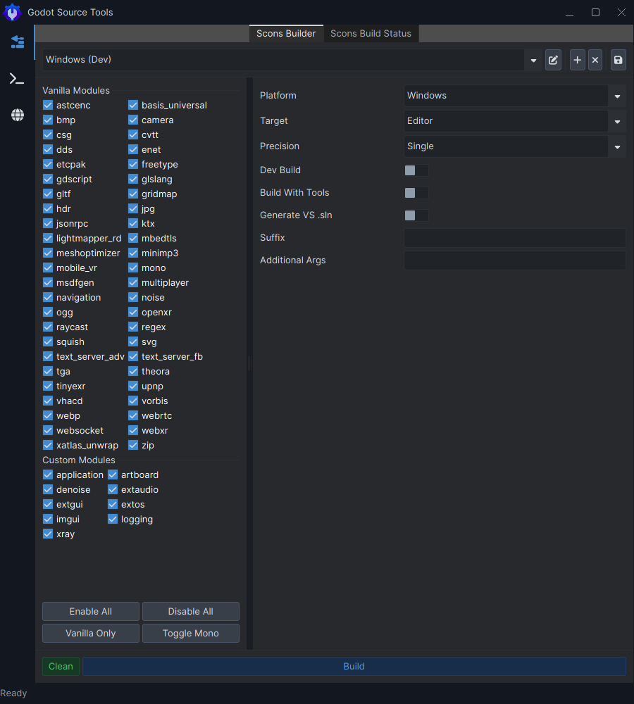

# Goals
The goals of Godot Source Tools are to:
- Be a companion tool alongside your IDE, not to replace it.
- Make developing modules/Godot Games/Apps easier and faster.
- Encourage development of Godot by developers who might be scared off by the somewhat daunting build process.
- Standardize developer workflows by removing constant mental overhead of maintaining special tools.

# Current Features
- Easy one click compilation of Godot Editor and Templates.
- Customization of modules to include with your Godot Engine distribution.
- Automatic detection of custom modules.
- Ability to compile Windows/OSX/Linux.

**Reasons you might want to implement GST into your workflow:**
- You're using an IDE/Text Editor that is a bit of a pain to set up for C++ compilation.
- You just want to compile the editor with a one or more modules (such as a Terrain module) but you have no clue where to start.
- You already use a half decent IDE (like VS or Rider) and you want to enhance your experience without having to constantly open a command window or write complex scripts to maintain a standardized workflow.
- Don't have a standardized workflow and want to get into writing your own Godot modules.
- You're always on cutting edge Godot.

**Reasons you wouldn't want to use GST:**
- You don't work with Godot's source code or write modules. You only operate solely within the confines of the Editor.
- You're looking to avoid Scons. Godot Source Tools **isn't** a _build system_. What it is, is a UI wrapper around Scons (for now).
- You already use the [Mesons fork](https://github.com/jpakkane/godot/tree/meson).
- You already have a workflow in place you are comfortable with; GST isn't going to be flexible enough to fit your workflow yet.
- You're wanting to compile Godot 3.x. Currently GST only supports cutting edge.

# Motivation
After spending some time developing Godot modules for myself, I got annoyed with the vanilla workflow; often I had to run scons but I had a somewhat particular set of build instructions so I had to remember the `Scons` args which got tedious very quickly. I ended up writing a crude batch script to smoothen out my workflow but it got very complex and cumbersome.

This tool was designed to integrate into my own workflow of how I utilize Godot Engine as a whole.

# Requirements & Installation For Use
## Windows
If you've already set up and run scons once to compile the engine then you're basically setup. However if you're downloading Godot Source Tools and have never compiled the engine before, here's what you will need to do before attempting to compile through the tool:
- Install Python. Preferably 3.6+.
- Ensure you have `Scons` tool installed globally. To do so, follow [this guide](https://scons.org/doc/production/HTML/scons-user/ch01s02.html).
- Install [VS 2022 Community](https://visualstudio.microsoft.com/vs/community/) with at least MSBuild + Windows SDK (Simply just add the Desktop C++ component bundle during install time).
- If you don't already have an existing Godot engine source folder on your PC, then clone Godot: `git clone https://github.com/godotengine/godot.git`
- Download a Release version of Godot Source Tools.

# Using Godot Source Tools
## Compiling Editor without C#
- Open the tool up and then load your sources by pressing File -> Open.
- Navigate to and open the folder that contains your Godot source.
- Press Enable All then Toggle Mono within the presets area.
- Ensure Target is set to "Editor" and "Build With Tools" is checked.
- Hit "Build".

# Currently Limitations
- Only Windows compilation on Windows has been tested.
- Android and iOS compilation does not work.
- Mono/C# distributions cannot be compiled.
- External modules not supported. Only modules within the `modules` folder.

# Roadmap
In no particular order, I'd love to add the following features in the near future:
- [ ] Module generator
- [ ] External module support
- [ ] Guidelines/Presets for creating minimal builds based on specific specs (ie leaving out 3D capabilities when dev only requires 2D)
- [ ] Provide visual representation of how each module impacts binary size
- [ ] Automatic installation of requirements 
- [ ] Module/GDExtension repository to allow in-app one tap download of modules to allow easier compilation of entirely custom builds
- [ ] Extra compilation options:
  - [x] Single/double precision 
  - [ ] Core count
- [ ] One tap Android compilation
- [ ] Full end-to-end Mono/C# compilation
- [ ] Automatic and custom source cloning/downloading
- [ ] Git workflow
  - [ ] One tap upstream from specific vanilla Godot branch to fetch/merge into specific project branch
  - [ ] One tap rebase/merge from vanilla Godot branch to project branch
- [ ] Easy one click local web hosting for Godot Web exports
- [ ] GDExtension support:
  - [ ] Ability to create new GDExtensions from different templates (Scons, cmake, etc)
  - [ ] Compilation from Godot Source Tools
- [ ] Command line control
- [ ] Batch building
- [ ] Make compatible with Mesons fork
- [ ] Support for different Godot branches other than `master` branch
- [x] Better UI visuals
- [ ] Spoken language translations
- [ ] General pck unpacking protection

# License
The source code itself is covered under the MIT license unless otherwise stated.

Any output generated from the tool (logging, binaries, etc) is not covered by this license and instead covered by the source that it was generated from. Please ensure you check the source code you are using to generate binaries using Godot Source Tools (this includes the module sources you download!).

All Godot Source Tools logos are not covered under the MIT license.